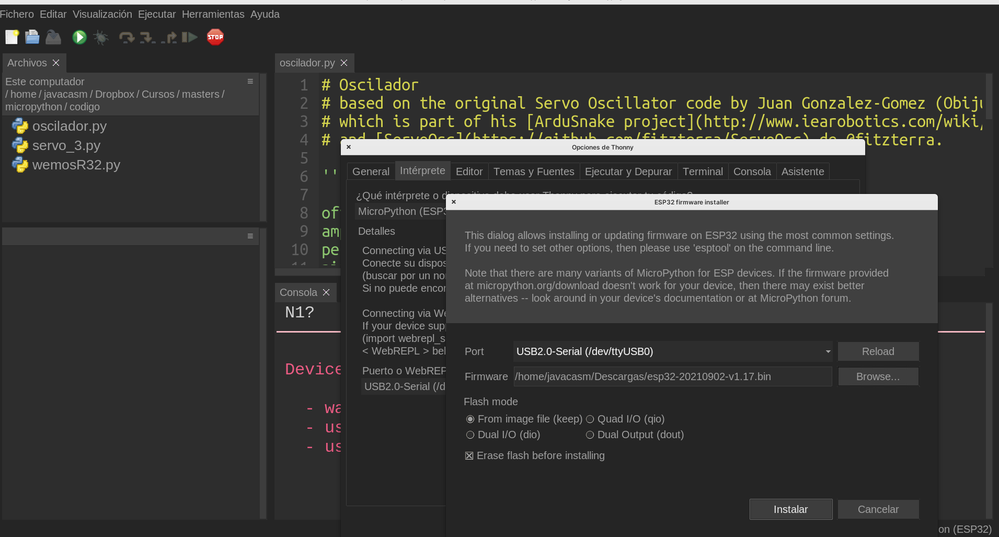
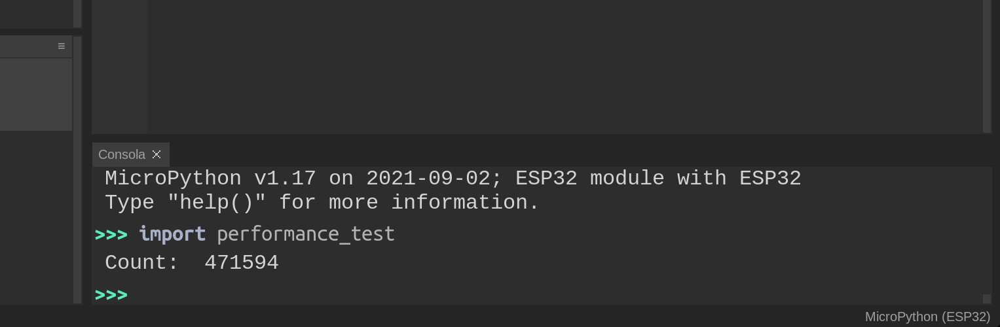
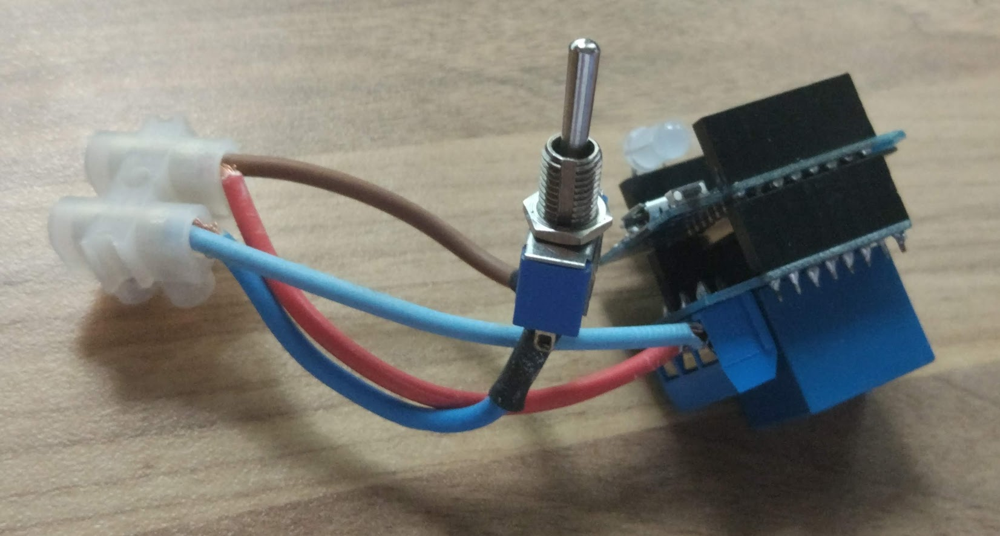

# Internet de las cosas fácil con micropython ... y el openSource....

## [https://bit.ly/IOTuPython](https://bit.ly/IOTuPython)

## Granabot 2022

## José Antonio Vacas @javacasm


## [¿Qué es IOT?](https://es.wikipedia.org/wiki/Internet_de_las_cosas)


(De Drawed by Wilgengebroed on Flickr - Translated by Prades97, CC BY-SA 3.0, https://commons.wikimedia.org/w/index.php?curid=32745149)


¿Qué dispositivos IOT conoces?


# IOT (Internet de las cosas)

¿Qué dispositivos te gustaría controlar remotamente?

* Calefacción.
* Aire acondicionado.
* Encender la cocina para calentar la comida antes de que lleguemos a casa.
* ¿Estás seguro que se han apagado todas las luces de la casa al salir?.
* Una alarma que nos avise de si hay algún problema cuando no estamos en casa.
* Poder ver el estado de un familiar remotamente.
* Controlar el ejercicio que hace durante un día para así motivarte a hacer más.
* Todas las aplicaciones que si tu curro de la domótica de una casa.

## Características de los dispositivos IOT

* Bajo consumo o mejor autosuficiente (un panel solar y una batería). Si tiene una pulsera de actividad sabrá que es necesario cargarla una vez al mes.
* Conectividad con otros dispositivos como puede ser un teléfono móvil ya sea por medio de Bluetooth y /o WiFi.
* Medir algo: actividad, temperatura, consumo.
* Almacenar los datos, que se guardan hasta que se vuelve a sincronizar.
* Estos datos se suelen subir a páginas web (thingspeak, blynk, adafruit, Cayenne, etc) Dónde se almacenan, y dónde posteriormente podemos construir nuestros gráficos e informes.

## Proyectos

Veamos algunos de los proyectos en los que podríamos trabajar:

* Estación meteorológica: mediremos las magnitudes atmosféricas, mostrando los datos, guardándose y publicándose en internet para su posterior análisis.

* Medida de consumo y fomento de la eficiencia energética: mediremos el consumo de nuestro propio equipo y veremos cómo a medida que vamos incluyendo más componentes el consumo se hace mayor. Podríamos adaptar este sistema a un uso real dentro de la casa y viendo el consumo de los electrodomésticos.

* Control remoto de componentes: mediante el uso de un relé vamos a poder encender y apagar dispositivos remotamente con nuestro sistema bien por el cambio de alguna tela sistemas que medimos o bien por accionamiento externo.

* Medida de calidad del aire. Usaremos sensores de medida de partículas para determinar la calidad del aire y al mismo tiempo también mediremos el contenido en gases y los parámetros atmosféricos. Publicaremos todos estos datos en una página web para poder comparar la medida en diferentes lugares.

## Algunos ejemplos:

* Pulsera para medir la actividad física.
  * Su batería dura unos ¡¡¡30 días!!!
  * Almacena sus datos (en local) y cuando puede se sincroniza (guardando datos en la nube).
  * Sólo proporciona información que luego vemos en otros dispositivos.
* Sistema de riego inteligente.
  * Un Arduino que mide la humedad y decide si activar o no una bomba de agua es una prueba de concepto.
  * Sistema de riego para una instalación de gran tamaño:
    * Cientos/miles de sensores de humedad.
    * Multitud de puntos de riego (válvulas/bombas).
    * Hacemos un datamining sobre los datos de humedad y se activan los puntos de riego.

### Qué le pedimos al IOT

* Inteligencia:
    * [Niveles](http://www.domodesk.com/a-fondo-que-es-el-internet-de-las-cosas): identidad, ubicación, estado, contexto, criterio. Ejemplo: los cientos de sensores de humedad de una gran explotación. Un nivel más de Inteligencia sería incluir predicción (por ejemplo la atmosférica: si sabemos a que va llover, esperamos antes de regar).
* Arquitectura
  * [Protocolos](http://www.domodesk.com/a-fondo-que-es-el-internet-de-las-cosas): Cable, Wifi, Zigbee, bluetooth, GSM (y todas sus Gs), ...
  * M2M: Comunicación Machine To Machine.
    * Un drone recoge datos del nivel de suciedad de los paneles solares.
    * Envía los datos  a la central.
    * Cuando el nivel es el adecuado se activa el robot de limpieza en determinada zona.


## ¿Cómo hacerse un IOT?

¿Qué necesito?

[Arquitectura de un sistema completo IOT](https://polaridad.es/grafica-sensor-internet-de-las-cosas-iot/)


## ¿Qué es Micropython?

Micropython: versión reducida del intérprete de Python adaptada para dispositivos "pequeños"


Nació en 2013,  cuando el físico y programador australiano **[Damien P. George](https://dpgeorge.net/)** creó una exitosa [campaña de crowdfunding en kickstarter](https://www.kickstarter.com/projects/214379695/micro-python-python-for-microcontrollers?lang=es) (tenía un objetivo de 15000£ y consiguió casi 100000£), dónde se desarrolló tanto el entorno de programación como una placa que fuera capaz de ejecutarlo la pyboard con STM32.


Aquella época = Arduino 

Podemos encontrar toda la documentación del proyecto en [su página](https://micropython.org/) y por supuesto en la [página del proyecto en github](https://github.com/micropython/micropython)

Se han creado más de 4000 forks

Muchísimas las plataformas:
* [pyboard](http://micropython.org/download/pybv1), 
* [ESP8266](http://micropython.org/download/esp8266) 
* [ESP32](http://micropython.org/download/esp32)
* [m5Stack](https://github.com/m5stack/M5Stack_MicroPython)
* [STM32](http://micropython.org/download/stm32)
* [micro:bit](https://microbit.org/get-started/user-guide/python/) 
* [Raspberry Pi](https://github.com/boochow/micropython-raspberrypi). 
* [Raspberry Pi Pico](http://micropython.org/download/rp2-pico).


MicroPython es:

* Una implementación completa de Python
* Diseñado para ser eficiente con los recursos
* Diseñado para ejecutarse nativamente sobre el hardware (sin sistema operativo de por medio). 


Incluye

* Un compilador, entorno de ejecución y un REPL.
    * Gestión de memoria
    * Sistema de archivos
    * Control del hardware
* Librerías y módulos básicos (normalmente empiezan con 'u' por micro)
* Módulos extra para controlar determinado hardware

En esta presentación de Damien George sobre Micropython podemos ver estos detalles


## Adafruit HUZZAH32 - ESP32 Feather

Es una excelente placa con un formato muy cómodo para trabajar con protoboard, que además incluye conector y cargador para batería Lipo


* 240 MHz dual core Tensilica LX6 microcontroller with 600 DMIPS
* 520 KB SRAM
* 802.11b/g/n HT40 Wi-Fi t
* Dual mode Bluetooth (classic and BLE)
* 4 MByte flash
* Hall sensor
* 10x capacitive touch interface
* 3 x UARTs 
* 3 x SPI 
* 2 x I2C 
* 12 x ADC de 12 bits
* 2 x I2S for Audio
* 2 x DAC de 10 bits

Conector JST para batería lipo, con cargador incorporado

Podemos leer el valor de la batería en A13/35. Debemos multiplicar por 2 el valor leído

Incorpora un led en la placa conectado al pin 13.

## Thonny


Thonny es un editor Open Source ([en este repositorio](https://github.com/thonny/thonny) está su código) pensado para trabajar con Python y está disponible para los principales sistemas operativos de PC o similares: Linux, MacOS, Windows, Raspberry,... ¡¡¡Está escrito en python!!!

## Instalación del firmware de micropython

Desde la [página de descargas de Micropython](https://micropython.org/download/) descargamos el firmware para nuestra placa. Suele ser un archivo con extensión **bin** o **uf2**, según el dispositivo.

Desde el menú Ejecutar pulsamos la opción "Elegir Intérprete"


Que nos abrirá una ventana donde seleccionamos el intérprete adecuado para nuestra placa:



### Uso de Thonny


El entorno Thonny tiene diferentes apartados dentro de su ventana principal, cada uno con diferente uso.


Cuando trabajamos con micropython usando Thonny (hemos seleccionado el intérprete adecuado) y tenemos conectada nuestra placa, veremos abajo lo que denominamos la **consola REPL** (o terminal).




### Vamos con los LEDs 


```python
import machine
>>> help(machine.Pin)
object <class 'Pin'> is of type type
  init -- <function>
  value -- <function>
  off -- <function>
  on -- <function>
  irq -- <function>
  IN -- 1
  OUT -- 3
  OPEN_DRAIN -- 7
  PULL_UP -- 2
  PULL_DOWN -- 1
  PULL_HOLD -- 4
  IRQ_RISING -- 1
  IRQ_FALLING -- 2
  WAKE_LOW -- 4
  WAKE_HIGH -- 5
```


```python
>>> import machine
>>> led = machine.Pin(13 , machine.Pin.OUT) # Para Wemos D1 R32
>>> led.on() # Lo encendemos
>>> led.off()  # Lo apagamos
```

Si lo estructuramos en funciones nos quedaría algo así:

```python
import machine
import time

v = 0.4 # Gracias Kiko

PIN_LED_PLACA = 13 # en otras placas puede ser el 4

# setup en arduino
led = machine.Pin(PIN_LED_PLACA, machine.Pin.OUT)


def parpadeo(tiempo_encendido = 250,tiempo_apagado = 250):
    # tiempos en milisegundos
    led.on()
    time.sleep_ms(tiempo_encendido)  # en milisegunos
    led.off()
    time.sleep_ms(tiempo_apagado)   # en milisegunos
# se acaba la función

def blinking_forever():
    while True :  # bucle loop en arduino
        parpadeo()
        
        # esta en el bucle
#fuera de la función
```
Ahora para ejecutarlo, importamos [nuestro fichero blinking](https://raw.githubusercontent.com/javacasm/CursoIOT_adv/main/codigo/inicial/blinking.py) y ejecutamos el método blinking_forever()

```python
import blinking
blinking.blinking_forever()
```
## PWM: regulando el nivel de un salida


Una forma de controlar la salida es **PWM**  que nos va a permitir conseguir una iluminación gradual de un led


```python
import machine

led = machine.Pin(13) 

pwm_led = machine.PWM(led)
```

Para controlar el nivel de modulación (duty cycle en inglés) usamos el método **duty(nivel)** con un valor entre 0  y 1023, con 1023 siendo el equivalente al 100%

```python
pwm_led.duty(0)  # totalmente apagado

pwm_led.duty(512)  # al 50%

pwm_led.duty(1023)  # al 100%

```

## Jugando con la frecuencia de refresco

Podemos modificar la frecuencia de PWM usando **pwm.freq(frecuencia)**, pudiendo estar entre 1Hz y 40MHz en el ESP32. También podemos hacerlo al crearlo con el atributo freq = frecuencia

```python
pwm_led = machine.PWM(machine.Pin(13), freq = 500)
```

Como ejemplo curioso si usamos la frecuencia de 1Hz (o valores por debajo de los 25 Hz) veremos parpadear el led

```python
pwm.freq(24)
pwm.duty(512) # 50%
```

## Saltando al mundo real


1. ¿Qué es un **relé**? un relé es un interruptor eléctrico que podemos accionar electrónicamente con una pequeña corriente y que funciona casi siempre electromecánicamente (un electroimán que atrae un contacto eléctrico) de ahí el 'clic-clic' que hacen al funcionar. 

1. Uso: los usaremos para controlar dispositivos que necesitan más potencia  que nuesta placa y/o que funcionan a mayores voltajes.
1. Control: para activar/desactivar los relés sólo tenemos que activar/desactivar el pin de nuestra placa al que está conectado
1. Alimentación y Consumo: el control de varios relés requiere de una mayor potencia de la que puede suministrar el puerto USB, por lo que usaremos un alimentación más potente si es posible.
1. Puesto que las señales de control de las placas son de 3.3V pudiera ser que algunos relés no se activen correctamente, aunque la mayoría sí.

## Controlando relés

Una aplicación directa de lo que hemos visto activando leds, puede ser controlar un módulo con varios relés al mismo tiempo.


Como hemos dicho, un relé es un dispositivo que nos permite controlar un dispositivo conectado a la corriente con una salida de nuestro dispositivo y sus modestos 5 voltios. Es decir, el relé actúa como un interruptor electrónico y al activar la patilla que lo controla se cierra el contacto que deja pasar la corriente al dispositivo


En el montaje del ejemplo vemos como el relé 1 actúa como interruptor del circuito de alimentación de la bombilla. Al activar la salida 18, que controla el relé 1 (por estar conectada a IN1) cerrará la salida del relé y la alimentación llegará a la bombilla. Podemos poner la alimentación desde un enchufe o desde cualquier otra fuente de alimentación. Los relés funcionan como un interruptor eléctrico.

Los dos círculos eléctricos, de alta potencia (la bombilla) y el de baja potencia (la placa) están aislados entre sí. No obstante **hay que tener cuidado al manejar la parte de alto voltaje/potencia**


```python
import machine

pin_reles = (18,19,23,5)
reles = []
for pin in pin_reles:
    rele = machine.Pin(pin,machine.Pin.OUT)
    reles.append(rele)

reles[2].on() # Encendemos el relé 2

reles[0].off() # Apagamos la bombilla
```
Y con esto ya estamos abriendo la puerta a la domótica...

## Sensores DHT

La familia de sensores DHT está formada por sensores de **temperatura** y **humedad** de bajo coste 


```python

>>> import dht
>>> import machine
>>> dht22 = dht.DHT22(machine.Pin(27))
>>> dht22.measure()
>>> dht22.temperature()
22.4
>>> dht22.humidity()
44.2
```

Vamos a empaquetarlo ahora en un fichero donde usaremos un bucle para tomar una medida cada segundo

```python
# Test dht
import dht
import machine
import time

v = 0.1

dht22 = dht.DHT22(machine.Pin(27))

while True:
    dht22.measure()
    print('Temperatura: ',dht22.temperature(),'º C Humedad:',dht22.humidity(),'%')
    time.sleep(1)

```
## Configuración del Wifi

Una de las características más útiles y que durante bastante tiempo ha sido distintiva de los dispositivos ESP ha sido la conectividad Wifi.

Configuramos la conexión para conectarnos a una red wifi ya existente, es lo que se conoce como **Station Interface**

```python
>>> import network
>>> wl = network.WLAN(network.STA_IF) # configuramos modo Station
>>> wl.active(True)     # activamos el interface wifi
>>> wl.connect("SSID","CLAVE_SSID")
>>> wl.ifconfig()  # Nos da la configuración de red: (ip,mask,gateway,dns server)
 ('192.168.1.55', '255.255.255.0', '192.168.1.1', '192.168.1.1') 

```


### Configuración del wifi en el arranque

Para que se conecte al iniciar podemos poner la conexión en el fichero boot.py:

```python
import network
import os
import time

print(f'm5Stack Core {os.uname()}')

iw = network.WLAN(network.STA_IF)
iw.active(True)
if not iw.isconnected(): # Comprobamos si ya está conectada
    iw.connect('miWifi','miPasswd')
    while not iw.isconnected():
        print('.', end='')
        time.sleep(1)
print(f'IP:{iw.ifconfig()[0]}')
```

## MQTT

Vamos a ver uno de los protocolos más usados en los sistemas domóticos: el MQTT.


**MQTT** es:

* un protocolo de comunicaciones entre dispositivos **sencillo** y *ligero*. 
* Es un protocolo seguro que soporta **autenticación** y cifrado **SSL**, aunque podemos elegir no usar estas características.
* Implementa distintos niveles de **QoS** (Quality of Service) 
* Los equipos conectados por **MQTT** envían y reciben mensajes que tienen un **Topic** y un **mensaje**.
* Los participantes pueden **publicar** y/o también se pueden **suscribir** a determinados topics, de manera que reciban los mensajes con ese topic.


Un sistema real tendrá más componentes


Existen brokers accesibles (y gratuitos para cierto número de peticiones) a través de internet como por ejemplo el de [HiveMQ](https://www.hivemq.com/public-mqtt-broker/) o [el de Adafruit](https://io.adafruit.com/) o [este mismo de mosquitto org](https://test.mosquitto.org/) o el de [thingspeak](mqtt.thingspeak.com) o el de [mqtt.eclipseprojects.io](mqtt.eclipseprojects.io). En [esta página](https://diyprojects.io/8-online-mqtt-brokers-iot-connected-objects-cloud/#.XwoEW9_ni-g) tenemos un listado.

También podemos instalar un  servidor **mosquitto** en la Raspberry:

```sh
sudo apt install mosquitto
```


### Ejemplo de arquitectura de topics

A medida que vamos añadiendo dispositivos y enviado más mensajes se puede complicar el árbol de topics

Para ellos es mejor usar una arquitectura. Por ejemplo esta, [tomada del blog de ricardo veal](https://ricveal.com/blog/sonoff-mqtt/)

```sh
    state_topic: "stat/sonoff/1/POWER"
    command_topic: "cmnd/sonoff/1/POWER"
    availability_topic: "tele/sonoff/1/LWT"
```
_Telemetría_ para que den información, por ejemplo los sensores.
_Command_ para peticiones 
_Stat_ para confirmaciones de estados

## MQTT

Vamos a ver uno de los protocolos más usados en los sistemas domóticos: el MQTT.


**MQTT** es:

* un protocolo de comunicaciones entre dispositivos **sencillo** y *ligero*. 
* Es un protocolo seguro que soporta **autenticación** y cifrado **SSL**, aunque podemos elegir no usar estas características.
* Implementa distintos niveles de **QoS** (Quality of Service) 
* Los equipos conectados por **MQTT** envían y reciben mensajes que tienen un **Topic** y un **mensaje**.
* Los participantes pueden **publicar** y/o también se pueden **suscribir** a determinados topics, de manera que reciban los mensajes con ese topic.


Un sistema real tendrá más componentes


Existen brokers accesibles (y gratuitos para cierto número de peticiones) a través de internet como por ejemplo el de [HiveMQ](https://www.hivemq.com/public-mqtt-broker/) o [el de Adafruit](https://io.adafruit.com/) o [este mismo de mosquitto org](https://test.mosquitto.org/) o el de [thingspeak](mqtt.thingspeak.com) o el de [mqtt.eclipseprojects.io](mqtt.eclipseprojects.io). En [esta página](https://diyprojects.io/8-online-mqtt-brokers-iot-connected-objects-cloud/#.XwoEW9_ni-g) tenemos un listado.

También podemos instalar un  servidor **mosquitto** en la Raspberry:

```sh
sudo apt install mosquitto
```


### Ejemplo de arquitectura de topics

A medida que vamos añadiendo dispositivos y enviado más mensajes se puede complicar el árbol de topics

Para ellos es mejor usar una arquitectura. Por ejemplo esta, [tomada del blog de ricardo veal](https://ricveal.com/blog/sonoff-mqtt/)

```sh
    state_topic: "stat/sonoff/1/POWER"
    command_topic: "cmnd/sonoff/1/POWER"
    availability_topic: "tele/sonoff/1/LWT"
```
_Telemetría_ para que den información, por ejemplo los sensores.
_Command_ para peticiones 
_Stat_ para confirmaciones de estados

## Publicación de contenidos en Adafruit IO

* Nos damos de alta en la plataforma. Con la versión gratuita tenemos límites de velocidad de envío y feeds.


```
Host	io.adafruit.com
Secure (SSL) Port	8883
Insecure Port	1883
MQTT over Websocket	443
Username	Your Adafruit IO Username
Password	Your Adafruit IO Key
```

[Código test_io_adafruit.py](https://raw.githubusercontent.com/javacasm/CharlaIOTFaciluPython/master/codigo/test_io_adafruit.py)


Donde usamos le módulo [umqttsimple](https://raw.githubusercontent.com/javacasm/CharlaIOTFaciluPython/master/codigo/umqttsimple.py)

## Control remoto con Adafruit IO

Vamos a modificar el programa que utilizamos para publicar datos en Adafruit IO, para ahora poder controlar unos relés remotamente.

Hemos conectado además del DHT22, los 3 relés a los pines 25,26 y 27. Son relés de lógica negativa, es decir al activar su señal de control se apagan y se encienden al apagarla. Los alimentamos desde los 5V de la placa, aunque funcionan perfectamente con los 3.3V de la señal de salida de los pines del ESP32.

```python
reles = []
pinesReles = (25,26,27)
for pinRele in pinesReles:
    rele = machine.Pin(pinRele,machine.Pin.OUT)
    rele.off()
    time.sleep_ms(10)
    rele.on() # Estos reles usan logica invertida
    reles.append(rele) 
```

Vamos a suscribirnos a los topics de los relés

```python
        for i in range(len(reles)):
            topic = topic_subRele+str(i+1) # Los nombres de los reles empiezan en 1
            client.subscribe(topic)
            print(f'Suscrito a {topic}')
```

ahora comprobaremos los topics y sus valores para ver si son sobre nuestros relés:

```python
    if sTopic.startswith(topic_subRele):
        posicion = int(sTopic[-1])-1 # los topic empiezan en 1 y la lista de reles en 0
        if sMsg == '0':
            reles[posicion].on() # Usan logica invertida
        elif sMsg == '1':
            reles[posicion].off() # Usan logica invertida
        else:
            print(f'Mensaje desconocido {topic} > {msg} ')
```

Y sacamos la comprobación de mensajes **client.check_msg()**  fuera de la espera para publicar datos.

[Código test_control_io_adafruit.py](https://raw.githubusercontent.com/javacasm/CharlaIOTFaciluPython/master/codigo/test_control_io_adafruit.py)

En Adafruit IO hemos creado los correspondientes feeds rele1,rele2 y rele3 y los ponemos en un dashboard con controles de botón (toggle)


Configurando cada uno para que muestre su nombre, vinculado a su correspondiente feed y que tenga el valor 1 ó 0 cuando esté activo o apagado.


Cuando nosotros actuamos sobre el control se publica un mensaje con el topic del feed y el valor del control


### Arquitectura del sistema doméstico: red de sensores y actuador

Vamos a montar un ejemplo muy sencillo:

* El centro de todo el sistema es una Raspberry Pi 3+ que actúa como broker MQTT (mosquitto) y donde se aloja [un programa en python](https://github.com/javacasm/micropythonTutorial/tree/master/codigo/controlCaldera) que implementa:
    * Un bot de telegram que muestra los datos y permite un control manual del sistema. 
    * Los datos de los distintos sensores se guardan en un fichero de texto. 
    * Dentro de este programa están las programadas las reglas de actuación: 
        if TemperaturaSalon<2 -> envía EnciendeCaldera
* Sensores de temperatura, humedad y presión (sensor BME280). Implementados en un Wemos D1 mini (ESP12E) y [programados en micropython](https://github.com/javacasm/micropythonTutorial/tree/master/codigo/MeteoSalon). Incluyen un led RGB para mostrar el estado y para depuración del sistema. Cada cierto tiempo envía un mensaje MQTT con los valores de temperatura, humedad, presión y voltaje de la batería. Escuchan los mensajes sobre el color del led. 

Uno de estos sensores se usa como centralita y muestra en todo momento el estado de encendido de la caldera, así como un "heartbeat" de que todo el sistema está funcionando.

* Actuador de la caldera: un Wemos D1 mini controla un relé con el que se enciende/apaga la caldera de la casa. También se ha conectado un led RGB para mostrar el estado del sistema. Se ha incluído un interruptor para poder puentear manualmente la salida del relé y así poder controlarla en caso de un problema de funcionamiento.

* Sensor de temperatura del circuito de calefacción: (en estado de prototipo) se trata de un equipo que mide con una sonda DS18x20 la temperatura del circuito de calefacción, enviando el valor por MQTT. Se le ha dotado de un relé que en futuras versiones encendería/apagaría la caldera.


En este sistema hemos evitado el problema de la conexión a internet usando un bot de telegram: nuestros datos no pasarán por los ordenadores del fabricante de los equipos pero sí que salen de nuestra casa. Es el precio a pagar para poder simplificar el acceder remotamente al sistema, por ejemplo desde nuestro móvil.

Vamos a ver ahora una implementación completamente profesional, y al mismo tiempo Open Source de un sistema de control doméstico.

